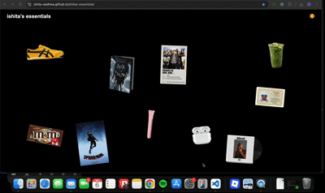

# Ishita’s Essentials 🌟

A fun, interactive collage-style website showcasing some of my favorite items, music, books, snacks, and everyday essentials. Click on the items to see more details in a playful popup!

  

---

## Table of Contents
- [Features](#features)
- [Technologies Used](#technologies-used)
- [How to Run](#how-to-run)
- [Project Preview](#project-preview)
- [Contact](#contact)

---

## Features
- 🎨 **Interactive Collage:** Clickable items with popups describing each item.  
- 🌞🌙 **Light/Dark Mode:** Toggle between light and dark themes using the sun/moon icon.  
- 📱 **Responsive Design:** Works on desktop and mobile screens.  
- 🖼️ **Collage Layout:** Items placed in a visually appealing scrapbook style.  

---

## Technologies Used
- HTML5  
- CSS3  
- JavaScript  
- Google Fonts (Caveat)  

---

Contact

📧 Email: ishitawadhwa6@gmail.com

🐱 GitHub: [mygithub](https://github.com/ishita-wadhwa)

💼 LinkedIn: [mylinkedin](https://www.linkedin.com/in/ishita-wadhwa-63a208315/)

Made with ❤️ by Ishita
